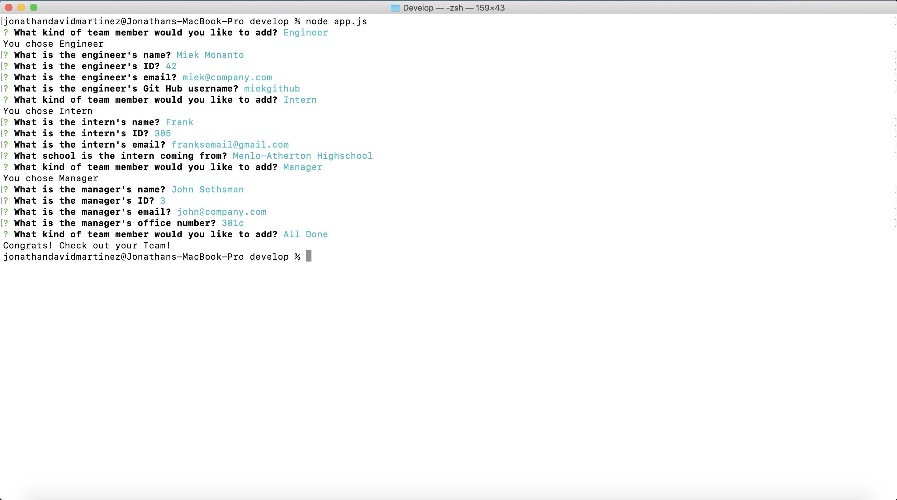

# template-engine-team-info

[](https://opensource.org/licenses/MIT)
[](https://shields.io/)
[](https://shields.io/)


## Description

This is an app designed to help you keep your teams information in one place with a clean interface. By using your Terminal you can input your teams information and generate this list! 

## Table of Contents

* [Preview](#preview)

* [Installation](#installation)

* [Test](#test)

* [Usage](#usage)

* [Project Significance](#project-significance)

* [Code Highlights](#code-highlights)

* [License](#license)

* [Contributing](#contributing)

* [Questions](#questions)

## Preview

<table>
  <tr>
    <td>Select Class and input info</td>
     <td>Add another Team member</td>
  </tr>
  <tr>
    <td valign="top"></td>
    <td valign="top"></td>
  </tr>
  <tr>
     <td>All Done!</td>
     <td>Display in browser</td>
  </tr>
  <tr>
    <td valign="top"></td>
    <td valign="top"></td>
  </tr>
 </table>

  *You can also check out a [video demonstration](https://www.youtube.com/watch?v=BemDmTusbpI)*

## Installation

To install necassary dependancies please use the following command(s): 

```
npm install // npm install inquirer // npm install jest
```

## Tests

To run tests, use the following command(s):

```
npm run test
```

## Usage 

To start the application you will have to download the source files into a working directory on your computer. Once you do you can open the working directory in Terminal(mac users) or Bash(windows users) to init the funciton. Before you do make sure you have inquirer installed as this is a hard depandancy for this application. 

Once initialized you will be prompted to select between the type of employee you want to add (Manager, Engineer, or Intern). Depemnding on the type of employee you choose different questions will be promptd: name, id, and email are all input information that are shared by the employee classes. When you are done adding the current team member you will be prompted once again to add a new team member. 

Once you are satisfied with the team you can select the "All Done!" option to end the loop and fetch the team list. The template will be rendered as an html file in the output folder that is located in the same directory as the app.js file. Open it in your browser to view your team's information. 

## Project Significance

This project stands out from the previous homework assignments in that it is the first instance of us using the browser and terminal to create an application. This is also our first implementation of classes. We are able to create specialized code blocks that are in charge of specific functionality. Instead of having one large js file that handles mutliple functions we used "module.exports" to divide and clean up our code. It allows for more readable and maintainible code. This was also our first homework assignment that included tests. I reall enjoyed the test. They gave more structure to the work flow and made it possible to break down a larger project into smaller chunks.

## Code Highlights

This is an example of having specialized code that takes care of one function. This js file took in information from the emploee.js file as well as sent out informtaion to be used in other sections of code.

```
const Employee = require("./Employee");

class Manager extends Employee {
    constructor(name, id, email, officeNumber){
        super(name, id, email);
        this.role = "Manager";
        this.officeNumber = officeNumber;
    };

    getOfficeNumber (){
        return this.officeNumber;
    };

};

module.exports = Manager;
```

I was also satisfied with my use of switch cases in this homework assignment. Using switch cases allowed me to simplify my code while still giving me the ability to prompt different questions based on the different employee types.
```
function addTeamMember() {
    inquirer
        .prompt([

            {
                type: "list",
                message: "What kind of team member would you like to add?",
                choices: ["Manager", "Engineer", "Intern", "All Done"],
                name: "memberClass",
            },
        ])
        .then(answer => {

            switch (answer.memberClass) {

                case "Manager":
                    console.log("You chose Manager");
                    promptManagerQs();
                    break;

                case "Engineer":
                    console.log("You chose Engineer");
                    promptEngineerQs();
                    break;

                case "Intern":
                    console.log("You chose Intern");
                    promptInternQs();
                    break;

                case "All Done":
                    fs.writeFile(outputPath, render(teamMembers), err => {
                        if(err) throw err;
                        console.log("Congrats! Check out your Team!");
                    });
                    break;
            };
        })
        .catch(() => {
            console.log("Can not render list in current environment");
        });
};
```

```
function createTMobj(answers, type) {
    let newTM;
    switch (type) {
        case "Manager":
            newTM = new Manager(answers.name, answers.id, answers.email, answers.officeNumber);
            break;
        case "Engineer":
            newTM = new Engineer(answers.name, answers.id, answers.email, answers.github);
            break;
        case "Intern":
            newTM = new Intern(answers.name, answers.id, answers.email, answers.school);
            break;
    };

    teamMembers.push(newTM);
    addTeamMember();
};
```

## License

MIT

## Contributing

[Jonathan-David Lopez Martinez](http://www.jds.world/)

## Questions 

If you have any questions about the repo, want to open an issue or contact me directly please reach out to focus4ursoul@gmail.com. Check out more of my work at [Goodlvn](https://github.com/Goodlvn).


